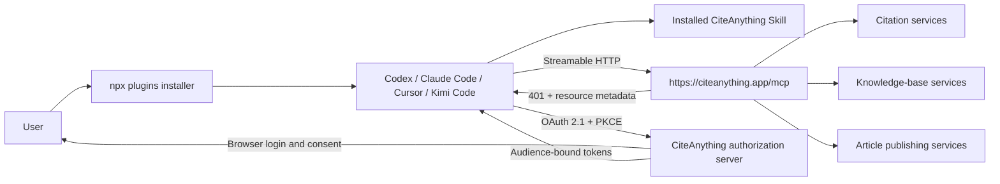

# CiteAnything Plugin One-Click Distribution Design

## Status

Approved for task breakdown on 2026-09-02. The v0.2 scope is the international
`citeanything.app` service; China-site one-click support is deferred without removing its existing
manual compatibility path. No release shall be described as one-click until the release gates in
this document pass.

## Executive Decision

CiteAnything will ship as a portable Agent Plugin whose primary runtime is a first-party remote
MCP server over Streamable HTTP:

```text
https://citeanything.app/mcp
```

The MCP resource server will use standards-based OAuth 2.1 discovery and browser authorization.
The host agent owns OAuth token storage and refresh. A normal user will not create a Skill Key,
export an environment variable, or edit MCP JSON.

The GitHub repository remains the installable, versioned package. A stable first-party web page at
`https://citeanything.app/plugin` will be the human- and agent-readable discovery entry. It will
point to the repository, canonical Skill, MCP endpoint, install command, current version, and
supported hosts.

The current local stdio server and Skill Key authentication remain a documented compatibility path
for clients that cannot use remote OAuth MCP. They are not the primary one-click path.

## System Context



There are three distinct layers:

1. **Distribution:** the Git repository, Agent Plugin manifests, native adapters, version tags, and
   the first-party discovery page.
2. **Agent guidance:** one canonical Skill that tells the model when and how to use the nine tools.
3. **Runtime:** the hosted MCP resource server, OAuth authorization server, and existing
   CiteAnything application services.

Network discovery and browsing remain the responsibility of the host agent. They are not part of
the CiteAnything MCP surface.

## Portable Plugin Package

### Canonical repository layout

```text
citeanything-plugin/
├── plugin.json
├── mcp.json
├── skills/
│   └── citeanything/
│       └── SKILL.md
├── contracts/
│   └── tools.json
├── .plugin/
├── .codex-plugin/
├── .claude-plugin/
├── .cursor-plugin/
├── .kimi-plugin/
├── .mcp.json
├── agents/
│   ├── open-plugin/.mcp.json
│   ├── claude/.mcp.json
│   └── cursor/mcp.json
├── assets/
│   └── citeanything-logo.svg
├── compatibility/
│   └── stdio/
│       └── server.mjs
├── scripts/
│   ├── generate-adapters.mjs
│   └── verify-package.mjs
├── test/
├── README.md
├── LICENSE
└── package.json
```

The package owns a versioned copy of the canonical CiteAnything SVG and declares that file explicitly
in Codex and Cursor metadata. Cursor's installed-plugin loader requires a repository-relative logo so
it can resolve the image to a local file URL. Its marketplace index resolves the same path against the
exact Git commit and its MCP view fetches that immutable raw-content URL. Both Cursor entries therefore
use `assets/citeanything-logo.svg`, and the generated verifier prevents either entry from drifting to
an external favicon or mobile-app asset. Hosts must not infer the plugin identity from a third-party
favicon service because those caches can continue serving obsolete brand artwork after the origin
asset changes.

Cursor App 3.18.25 has a personal-marketplace display limitation: after installation, the Customize
detail page prefers the backend installed-plugin record over the parsed GitHub marketplace record and
merges only installation scopes, not `logoUrl`. The detail header consequently shows Cursor's generic
fallback even though the same installation resolves the canonical SVG for its MCP server. This cannot
be repaired with an additional manifest field; the package already uses Cursor's supported `logo`
field. Official marketplace publication or a Cursor client fix must preserve or merge that field into
the installed-plugin record.

The Cursor marketplace manifest uses the stable registration name
`veriglow-citeanything-plugin`. This must match the marketplace identity already registered by the
GitHub-repository installation path; changing it to the shorter plugin name causes Cursor refreshes
to reject the replacement entry even when the plugin itself parses successfully.

`plugin.json`, `mcp.json`, and `skills/` occupy the standard root locations required by Agent
Plugins 1.0. Generated compatibility adapters translate those canonical sources into each host's
accepted syntax rather than becoming independent sources of truth.

### Root plugin manifest

The root manifest identifies the package, version, publisher, repository, homepage, license, Skill,
and MCP contribution. It contains no credentials and no host-specific absolute paths.

### Root MCP manifest

The portable manifest contains one remote server:

```json
{
  "$schema": "https://agent-plugins.org/schemas/1.0.0/mcp.schema.json",
  "mcpServers": {
    "citeanything": {
      "type": "streamable-http",
      "url": "https://citeanything.app/mcp"
    }
  }
}
```

No `env` block or API key placeholder is present. Clients that implement MCP authorization discover
the authorization server from the resource server response.

The canonical `mcp.json` retains the Agent Plugins schema and its `streamable-http` transport name.
Generated companion files omit that schema where a host rejects unknown fields and use the host's
accepted spelling, such as `http`, or Cursor's bare server map. This is semantic parity, not a
byte-for-byte copy requirement.

The generated `.plugin/plugin.json` is the Open Plugin input adapter consumed by Vercel Labs'
`plugins` CLI. That CLI is a distribution implementation, not the canonical package specification.

### Canonical Skill

The canonical Skill moves to `skills/citeanything/SKILL.md`. It preserves the current operating
boundary:

- use the host's tools to search and inspect public web content;
- use CiteAnything only to create/retrieve citations, work with the private knowledge base, and
  publish cited articles;
- inspect original evidence before creating a citation;
- never invent anchors, quoted text, tokens, or verification state.

Root or native copies are generated from this file or replaced by references where the host permits
that. CI fails when any adapter Skill differs from the canonical Skill.

## Canonical Tool Contract

`contracts/tools.json` is the machine-readable source of truth shared by:

- the hosted MCP server;
- the stdio compatibility server;
- generated host adapters;
- contract tests;
- future `citeanything-harness` training trajectory adapters.

It defines exactly these public tool names and their JSON Schemas:

| Tool | Capability | Required scope |
| --- | --- | --- |
| `create_citations` | Create web or KB evidence citations | `citation:write` |
| `get_citation` | Read one owned citation and preview state | `citation:read` |
| `wait_for_citation_preview` | Wait for preview completion | `citation:read` |
| `list_knowledge_base` | List owned KB documents | `kb:read` |
| `search_knowledge_base` | Search owned extracted pages | `kb:read` |
| `read_knowledge_base_page` | Read an owned page | `kb:read` |
| `import_pdf_to_knowledge_base` | Import one public PDF | `kb:write` |
| `wait_for_knowledge_base_document` | Wait for KB processing | `kb:read` |
| `publish_article` | Publish cited Markdown | `article:write` |

The initial authorization request asks for all five scopes because the installed Plugin is presented
as one product. The authorization server records and returns the exact granted set, and the MCP
server enforces the minimum scope per tool. The design preserves the ability to offer reduced-scope
install profiles later without changing tool schemas.

No public contract entry may match or alias general-purpose `search`, `open`, `click`, `find`,
`crawl`, browser automation, or arbitrary content fetching. `import_pdf_to_knowledge_base` accepts
only a directly relevant public PDF and retains the existing restricted downloader controls.

## Remote MCP Runtime

### Hosting

The existing CiteAnything FastAPI service will mount an MCP Streamable HTTP application at `/mcp`
using the official Python MCP SDK. The parent FastAPI lifespan starts and closes the MCP session
manager together with the existing database and durable-run services.

The server should use stateless operation and JSON responses when supported by the final SDK version
selected during implementation. This reduces per-instance session affinity and fits the existing
deployment model. Protocol-version negotiation remains the SDK's responsibility.

### Application boundary

MCP handlers do not make recursive authenticated HTTP requests to the public CiteAnything API and
do not pass the bearer token downstream. Each handler receives an authenticated principal and calls
an internal application service with an explicit `user_id` and scope set.

Existing route modules currently mix HTTP validation with business logic. Reusable operations will
be extracted incrementally into service functions:

```text
MCP tool handler ─┐
                  ├─> application service ─> database / queue / storage
REST API route ───┘
```

This avoids two implementations of citation, KB, or publishing behavior and keeps user ownership
checks identical across REST and MCP.

### Tool-to-service mapping

- Citation creation reuses batch citation creation and idempotency behavior.
- Citation retrieval and preview waiting reuse citation ownership and preview state logic.
- KB list/search/page calls reuse owned-document and ready-state validation.
- PDF import performs the fetch on the CiteAnything backend, preserving private-address blocking,
  DNS/IP validation, redirect limits, response-size limits, timeout limits, and PDF signature/content
  checks before handing the file to the existing ingestion pipeline.
- Article publishing reuses marker verification and article ownership rules.

Polling tools apply bounded server-side waits and return terminal, timeout, or retryable states. They
must not hold a request indefinitely.

## OAuth 2.1 Authorization

### Protocol

The remote MCP resource follows the MCP authorization specification and OAuth 2.1 security profile:

- Protected Resource Metadata (RFC 9728);
- Authorization Server Metadata (RFC 8414);
- authorization code grant with PKCE S256;
- resource indicators and strict access-token audience binding;
- short-lived bearer access tokens;
- rotating refresh tokens and revocation;
- dynamic client registration for MCP clients that require it;
- Client ID Metadata Document support when the final client/spec combination supports it.

The implementation will support both the MCP 2025-06-18 DCR-era client behavior and the current
metadata-document path where practical. Known host clients may also use pre-registered public client
IDs. All desktop/CLI clients are public clients: no client secret is embedded in the plugin.

### Discovery endpoints

At minimum, the public service exposes:

```text
GET  /.well-known/oauth-protected-resource/mcp
GET  /.well-known/oauth-authorization-server
POST /oauth/register
GET  /oauth/authorize
POST /oauth/token
POST /oauth/revoke
```

If interoperability testing shows clients resolve the protected-resource metadata from an alternate
well-known location permitted by the specification, the service exposes the equivalent alias.

An unauthenticated `/mcp` request returns `401 Unauthorized` with a standards-compliant
`WWW-Authenticate` challenge that points to the protected-resource metadata. Insufficient scope
returns a non-secret OAuth error and the required scope.

### Browser flow

1. The host connects to `/mcp` and receives the authorization challenge.
2. The host discovers metadata, creates or identifies its public client, creates PKCE and state
   values, and opens `/oauth/authorize` in the browser.
3. CiteAnything uses the existing web account session. An unauthenticated user signs in first.
4. The approval page names the requesting client, resource, and five requested scopes.
5. Approval creates a short-lived, single-use authorization code bound to client, redirect URI,
   resource, scopes, and PKCE challenge.
6. The host exchanges the code at `/oauth/token`, stores the tokens, and retries the MCP request.
7. Refresh rotation and revocation occur through standard OAuth endpoints without Plugin-specific
   prompts or copied secrets.

Cancellation, expiry, mismatched state, redirect URI, verifier, client, or resource fail closed.

### Token model

Access tokens are signed tokens with:

- type `mcp_access`;
- subject equal to the CiteAnything user ID;
- audience exactly `https://citeanything.app/mcp`;
- client ID and granted scopes;
- issued-at, expiry, and unique token ID.

Access tokens expire in one hour unless security review selects a shorter duration. Refresh tokens
are opaque, stored server-side only as hashes, rotated on every successful refresh, and limited to a
90-day absolute session lifetime. Reuse of an invalidated refresh token revokes the token family.

The MCP resource server accepts only `mcp_access` tokens with the correct audience. Existing web,
CLI, legacy local, and Skill Key credentials are not accepted at `/mcp`.

### Persistence

OAuth persistence is separate from the existing CLI protocol even though implementation helpers may
be shared:

- `McpOAuthClient`: client ID, metadata, allowed redirect URIs, registration method, timestamps;
- `McpAuthorizationGrant`: hashed code, user, client, redirect URI, resource, scopes, PKCE challenge,
  expiry, consumed timestamp;
- `McpSession`: user, client, resource, scopes, hashed refresh token, token-family ID, expiry,
  revocation state, timestamps.

Authorization codes and refresh tokens are never stored in plaintext. Cleanup removes expired grants
and sessions. A connected-apps surface allows the user to see and revoke active MCP clients.

### Relationship to existing CLI login

The current CLI browser/device flow already provides useful primitives: PKCE, expiring one-time
grants, hashed secrets, rotating refresh tokens, rate limits, and revocable sessions. Shared helpers
may be extracted for those primitives. OAuth endpoint semantics, metadata, client registration,
resource/audience validation, scopes, and data models remain distinct.

The product boundary changes from “all Skill/MCP integrations use Skill Keys” to:

- first-party hosted CiteAnything Plugin: MCP OAuth;
- first-party CiteAnything CLI: existing account-session protocol until separately migrated;
- legacy/manual stdio and third-party direct REST integrations: scoped Skill Keys.

## Host Integration Strategy

The portable Agent Plugin is canonical. Host-native packaging exists only where it improves
installation compatibility or marketplace presence.

| Host | Preferred installation | Runtime | Adapter policy |
| --- | --- | --- | --- |
| Codex app/CLI | Verified native marketplace one-liner; `npx plugins add` remains a candidate | Remote MCP OAuth | Generated manifest if native format requires one |
| Claude Code | Native marketplace one-liner installs one Skill and one MCP; OAuth verification pending | Remote MCP OAuth | Generated `.claude-plugin` metadata and host-compatible MCP file |
| Cursor | Native personal-marketplace install; OAuth verification pending; 3.18.25 detail header has a logo fallback bug | Remote MCP OAuth | Generated `.cursor-plugin` metadata only; official marketplace publication pending |
| Kimi Code CLI | `plugins@1.3.4 --target kimi` installs to the managed store; combined agent-runtime verification pending; native MCP fallback verified | Remote MCP OAuth | Generated inline HTTP adapter; retain the native fallback until the complete runtime path passes |

The installer discovery gate is authoritative: success requires it to report both the Skill and MCP
server. A host that can install only the Skill is labeled “Skill-only,” not “Plugin installed.”
Installation commands may differ by host. The product contract standardizes the resulting Skill,
MCP endpoint, tools, and authentication semantics rather than requiring one universal installer.

Because host capabilities change independently, the compatibility matrix is generated from tested
versions and includes the test date. Unsupported behavior is not papered over with shell setup.

### Legacy stdio fallback

For a host that supports stdio MCP but not remote OAuth, the compatibility server may continue to
use a scoped Skill Key. It lives outside the canonical root contribution so portable installers do
not select it by accident. A future stdio browser/device login can be added only if the host cannot
adopt standard remote authorization; it is not required for this release.

## Regional Endpoint Policy

The v0.2 one-click package targets `https://citeanything.app` as its single canonical OAuth issuer
and MCP resource. A portable `mcp.json` cannot safely switch issuers or data regions through ambient
environment variables, and OAuth audiences must be exact.

`https://citeanything.cn` remains available through the documented native/manual compatibility path
for this release. China one-click support should later ship as a separately identified regional
plugin or a deliberate account-region routing design; it must not silently redirect OAuth or move
user data between regions.

This is a release-scoping decision, not an assertion that the China product is secondary. It avoids
creating an insecure or ambiguous multi-issuer package merely to claim parity.

## Public Discovery

`https://citeanything.app/plugin` becomes the stable product entry. It provides:

- product name and concise capability statement;
- one-command installation;
- repository and current signed/tagged release;
- canonical Skill URL;
- MCP endpoint and transport;
- exact nine-tool list and explicit no-web-search boundary;
- supported-host matrix and last verification date;
- browser-login explanation and permission scopes;
- manual Skill, remote MCP, and legacy stdio fallbacks;
- update, uninstall, revoke, and troubleshooting instructions.

The page also exposes structured, cacheable metadata. `https://citeanything.app/SKILL.md` (with an
optional `/SKILL` redirect) serves the canonical Skill as plain Markdown. The repository remains the
versioned source of truth; the website publishes the released version rather than an unreviewed
branch snapshot.

## Versioning and Release

This work is a backward-compatible capability and packaging expansion. The first public v0.2
package was indexed as `v0.2.0`; subsequent packaging corrections, including an explicitly bundled
canonical logo, use patch releases beginning with `v0.2.1`. Version 1.0 remains reserved for a
stable public contract after multiple host interoperability runs.

Release sequence:

1. land backend MCP/OAuth support behind a disabled feature flag;
2. deploy metadata and MCP endpoint to staging;
3. run OAuth and tool contract tests against staging;
4. publish a plugin release candidate tag and test clean installs;
5. enable production MCP OAuth;
6. tag the current v0.2 patch release, publish the discovery page, and update marketplace entries;
7. verify the exact released Git tag through every locally testable host.

Rollback disables new authorizations and MCP routing while leaving existing REST, CLI, and Skill Key
flows intact. Existing v0.1 users keep their manual stdio path until they choose to update.

## Security Design

- OAuth redirect URIs use exact matching; loopback ports follow native-app rules only where allowed.
- PKCE S256 is mandatory and plain PKCE is rejected.
- Authorization code, device code if later added, refresh token, and registration endpoints are rate
  limited and audited without logging secrets.
- Access tokens are never forwarded from the MCP resource server to another service.
- Every tool starts from the authenticated principal and repeats resource ownership checks.
- Error messages omit tokens, database identifiers not needed by the caller, and internal paths.
- MCP prompts, resources, and tool outputs are treated as untrusted content; they never become shell
  input.
- PDF imports preserve SSRF defenses across DNS resolution and every redirect, block private and
  special-use networks, cap bytes and time, and validate the final content.
- Consent, session, and tool audit events identify client, user, scopes, action, result, and time but
  exclude evidence bodies and credentials by default.
- Database migrations are additive and reversible before old compatibility paths are removed.

## Verification Strategy

### Contract and package tests

- validate `plugin.json` and `mcp.json` against Agent Plugins schemas;
- assert root standard locations and absence of credential placeholders;
- assert the exact nine tool names, schemas, annotations, and required scopes;
- assert forbidden general-web tool names are absent;
- regenerate all host adapters and fail on a dirty diff;
- run `npx plugins discover` against the repository and released tag;
- install into isolated temporary home/project scopes and inspect native registrations.

### OAuth tests

- metadata and `WWW-Authenticate` interoperability;
- public-client authorization code + PKCE success;
- login, consent, denial, expiry, replay, wrong verifier, wrong redirect, wrong client, and wrong
  resource cases;
- refresh rotation, token-family replay response, revocation, and expiry;
- scope denial per MCP tool;
- rejection of CLI, web, legacy, and Skill Key tokens at `/mcp`;
- no secrets in application logs or MCP error payloads.

### MCP and application tests

- protocol initialize, tools/list, and tool call over Streamable HTTP;
- ownership isolation between two test users;
- REST and MCP parity for representative citation, KB, and article operations;
- bounded polling behavior and cancellation;
- PDF SSRF, redirect, size, timeout, MIME/signature, and processing cases;
- exact response envelope and error-code snapshots for the canonical contract.

### End-to-end release gate

On a clean Codex test profile with no `CITEANYTHING_API_KEY`:

1. run `codex plugin marketplace add veriglow/citeanything-plugin --ref main && codex plugin add citeanything@citeanything`;
2. confirm the host sees the Skill and one MCP server;
3. invoke `list_knowledge_base`;
4. complete browser login and consent;
5. repeat or automatically continue the call;
6. receive the authenticated user's document list;
7. restart the host and confirm secure refresh without another manual secret step;
8. revoke the connection and confirm the next protected call requires authorization.

For each additional host, repeat the lifecycle through that host's native installation path. The
release remains a candidate until this path passes on every host advertised as fully supported.

## Repository and Product Changes

Implementation spans two repositories/workspaces:

### `citeanything-plugin`

- add root Agent Plugin manifests and canonical directories;
- move the Skill and tool schemas to canonical sources;
- generate/check native adapters;
- retain stdio under an explicit compatibility path;
- add package, discovery, and contract tests;
- rewrite README around the verified one-command path.

### `veriglow`

- add MCP runtime and OAuth modules to the CiteAnything server;
- extract shared application services from citation, KB, and publishing routes;
- add OAuth persistence and migrations;
- add browser consent and connected-app revocation UI;
- publish `/plugin` and released Skill/metadata endpoints;
- update `citeanything/specs/`, `inventory.json`, dependencies, and runtime configuration.

Under the existing object taxonomy, MCP/OAuth implementation and manifests are Code/Config objects;
the Skill and product specification are Knowledge objects; OAuth sessions, grants, and imported
documents are Data objects; the discovery/consent UI is a UI object. The implementation phase must
record exact classifications in `inventory.json`.

## Alternatives Considered

### Keep stdio plus `CITEANYTHING_API_KEY` as the primary path

Rejected. It installs code but does not provide one-click use: the user must separately create,
copy, store, and configure a long-lived secret. It also conflicts with portable-plugin guidance
against reliance on arbitrary inherited environment variables.

### Add a proprietary browser/device login inside the stdio process

Not selected for the primary path. It can be secure and could reuse the existing CLI protocol, but
it makes the MCP tool process responsible for credential storage and refresh, may exceed the first
tool-call timeout, and bypasses host-native MCP authorization UX.

### Let the remote MCP server forward the host bearer token to REST endpoints

Rejected. OAuth tokens are audience-bound to the MCP resource and must not be passed through to a
different resource. Direct internal service calls are both safer and easier to keep consistent.

### Put web search tools into the Plugin for convenience

Rejected by product boundary. Host agents already provide discovery and browsing. CiteAnything's
role begins when evidence has been inspected and needs durable citation, private-KB retrieval, or
publication.

### Use one manifest that switches between `.app` and `.cn` from an environment variable

Rejected for the OAuth one-click path. Issuer, protected resource, audience, account, and data region
must be explicit. Regional one-click packages can be added once their identity and data behavior are
specified and tested.

## Decisions Requested Before Task Breakdown

Approval of this design confirms the following product choices:

1. remote Streamable HTTP MCP with browser OAuth is the primary one-click runtime;
2. the host stores OAuth credentials; Skill Keys remain only a legacy/manual compatibility method;
3. v0.2 requests all five least-privilege capability scopes at install-time authorization;
4. `citeanything.app` is the v0.2 canonical issuer/resource, while `.cn` keeps a documented
   compatibility path pending a separate regional one-click design;
5. releases remain on the current v0.2 patch line, with `v1.0.0` deferred until the contract has
   demonstrated multi-host stability.
